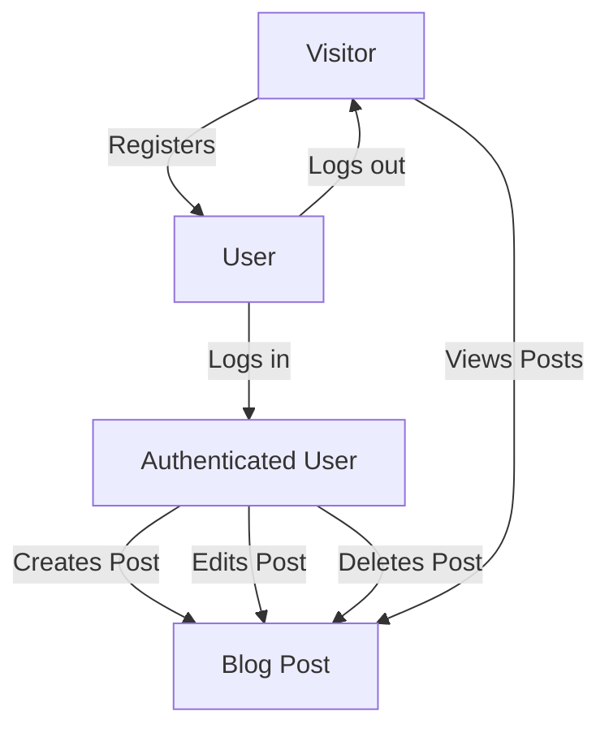

# Simple Django Blog

This is a beginner-friendly blog application built with Django, Bootstrap, and SQLite. It allows users to register, log in, create, edit, and delete blog posts. The project is intentionally kept very basic, as if made by a beginner or intern, to help new developers understand Django’s core concepts without advanced features or complexity.

---

## Project Workflow



---

## Features
- User registration and login (no email required)
- Create, edit, and delete blog posts (only by the author)
- Simple, clean Bootstrap UI
- SQLite database (default for Django)

---

## What Was Changed and Why

- **Simplified Codebase:**
  - Removed advanced Django features (like class-based views, custom methods, and widgets) to make the code easy to follow for beginners.
  - All views are function-based for clarity and simplicity.
- **Minimal Forms:**
  - Registration form only asks for username and password, making it less intimidating for new users and developers.
- **Basic Templates:**
  - Templates use only the most basic Bootstrap components (buttons, forms, lists).
  - No icons, cards, or advanced layout—just what’s needed to get the job done.
- **Easy to Run and Understand:**
  - No extra dependencies or configuration.
  - Can be run locally with just a few commands.

---

## Why We Did This
- **For Learning:** The project is designed to be a learning tool for new Django developers, showing only the essentials.
- **For Clarity:** By removing advanced features, the code is easier to read, understand, and modify.
- **For Simplicity:** The UI and workflow are kept as simple as possible, so new developers can focus on Django basics.

---

## Getting Started

1. **Clone the repository**
   ```bash
   git clone <your-repo-url>
   cd blog_cursor
   ```
2. **Install dependencies**
   ```bash
   pip install -r requirements.txt
   ```
3. **Apply migrations**
   ```bash
   python manage.py migrate
   ```
4. **Create a superuser (optional)**
   ```bash
   python manage.py createsuperuser
   ```
5. **Run the server**
   ```bash
   python manage.py runserver
   ```
6. **Open in your browser**
   - Go to [http://127.0.0.1:8000/](http://127.0.0.1:8000/)

---

## License

MIT License 